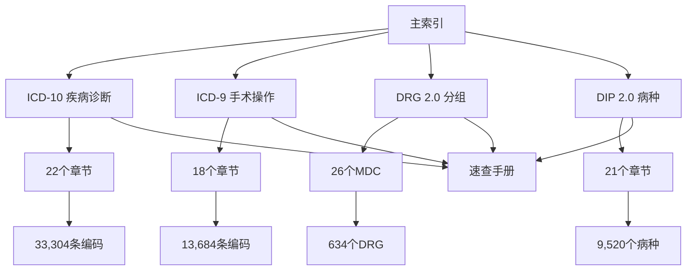

---
tags:
  - index
  - home
  - navigation
created: 2026-06-18
updated: 2026-06-18
---

# 🏥 ICD 编码知识库 - 主索引

> 基于 Karpathy LLM Wiki + SQLite 数据驱动架构。
> Markdown 即源码，AI 即查询引擎，改数据自动刷新笔记。

---

## 📈 数据统计

- **ICD-10 疾病诊断**：33,304 条编码（22 章）
- **ICD-9 手术操作**：13,684 条编码（18 章）
- **DRG 2.0 分组**：26 MDC · 409 ADRG · 634 DRG
  - 严重合并症/并发症（MCC）：148 组
  - 一般合并症/并发症（CC）：54 组
  - 不伴合并症/并发症：126 组
- **DIP 2.0 病种**：9,520 种

---

## 🧭 快速导航

### 📚 核心编码系统

| 模块 | 说明 | 快速入口 |
|------|------|----------|
| **[[ICD10-疾病诊断/_index\|ICD-10 诊断]]** | 22章 · 33,304 条编码 | [[ICD10-疾病诊断/_index\|查看全部]] |
| **[[ICD9-手术操作/_index\|ICD-9 手术]]** | 18章 · 13,684 条编码 | [[ICD9-手术操作/_index\|查看全部]] |
| **[[DRG-分组/_index\|DRG 2.0 分组]]** | 409 个 DRG 组 | [[DRG-分组/_index\|查看全部]] |
| **[[DIP-病种/_index\|DIP 2.0 病种]]** | 9,520 个病种 | [[DIP-病种/_index\|查看全部]] |

### 🔍 速查工具

| 工具 | 用途 | 链接 |
|------|------|------|
| **常见诊断速查** | 高频诊断编码 | [[速查手册/常见诊断编码速查\|打开]] |
| **常见手术速查** | 高频手术编码 | [[速查手册/常见手术编码速查\|打开]] |
| **编码规则要点** | 核心编码规则 | [[速查手册/编码规则要点\|打开]] |
| **ICD-Web调试速查** | Web应用调试 | [[速查手册/ICD-Web调试速查\|打开]] |

---

## 🎯 使用场景

### 🤖 作为 AI 助手
直接问我：
- **查编码**： "查找 心肌梗死 的编码"
- **查规则**： "肿瘤编码规则是什么"
- **对比分析**： "比较 ICD-10 和 ICD-9 在心脏手术编码上的差异"
- **分析分组**： "这个病例应该分到哪个 DRG 组"

### 👨‍⚕️ 作为临床医生
- 查找诊断/手术的标准编码
- 理解编码规则和合并编码原则
- 使用速查手册快速定位常用编码

### 👨‍💻 作为编码员
- 验证编码的准确性
- 学习编码规则和最佳实践
- 使用案例库参考实际编码

---

## 🔧 数据更新流程

```bash
# 1. 更新数据库
cd _builder
python init_db.py

# 2. 重新生成 Obsidian 笔记
python generate_md.py

# 3. 导出网页数据（可选）
python generate_web.py
```

---

## 📊 知识图谱



---

## 🔗 跨模块关联

### ICD-10 ↔ ICD-9 关联
- 诊断编码 ↔ 手术操作编码
- 疾病分类 ↔ 手术分类

### ICD-10/ICD-9 ↔ DRG 关联
- 诊断编码 → DRG 分组映射
- 手术编码 → DRG 分组映射
- 合并症/并发症 → DRG 调整

### ICD-10/ICD-9 ↔ DIP 关联
- 诊断编码 → DIP 病种映射
- 手术编码 → DIP 病种映射

---

## 📝 维护指南

### 添加新内容
1. 使用 `_模板/` 中的模板
2. 使用 `[[编码名称]]` 链接相关知识
3. 使用 `#icd10`、`#icd9`、`#drg` 打标签

### 数据质量检查
- 确保 frontmatter 完整
- 验证链接有效性
- 检查编码格式规范

---

## 🎓 学习路径

### 初学者
1. [[速查手册/编码规则要点|编码规则要点]]
2. [[速查手册/常见诊断编码速查|常见诊断速查]]
3. [[速查手册/常见手术编码速查|常见手术速查]]

### 进阶者
1. [[ICD10-疾病诊断/_index|ICD-10 总览]]
2. [[ICD9-手术操作/_index|ICD-9 总览]]
3. [[DRG-分组/_index|DRG 分组]]

### 专家级
1. 跨模块关联分析
2. 数据质量优化
3. 知识图谱构建

---

## 📞 技术支持

- **数据问题**：检查 `_builder/` 目录下的脚本
- **链接问题**：使用 Obsidian 的链接检查功能
- **格式问题**：参考 `_模板/` 中的模板

---

**最后更新**：2026-06-18
**版本**：v1.0
**维护者**：Claudian AI Assistant